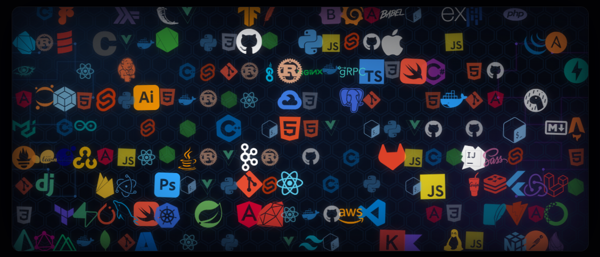

  <h1 style="font-size: 2.5em;">
    
    Hi, I'm 
    
      Shravani Korde
    
  </h1>

  

 
<h2>
  👩‍💻 About Me
</h2>
 

  

 
 
  
<ul style="color: #ffffff; font-size: 1.05em; line-height: 2.4; list-style: none; padding-left: 0;">
    
  ✨ <b>Engineering Student</b> building scalable systems.
  
  💻 Focused on <b>Clean & User-friendly</b> experiences.
  
  🚀 Solving <b>Real-world Problems</b> through code.
  
  📚 Constantly <b>Learning</b> new technologies.
  
  ⚡ Interested in <b>Backend & System Design</b>.
  
</ul>

 

  

<!-- Tech Stack -->

  <h2 align="center">
    💻 Tech Stack 
  </h2>

| 🚀 Domain | 💻 Tech Stack & Tools |
| :--- | :--- |
|  **Programming Languages**   |       |
|  **Web Development**   |       |
|  **Backend & Databases**   |       |
|  **DevOps & Tools**   |       |
|  **Current Learning**   |   ⚡ `System Design` &nbsp; ⚡ `Microservices` &nbsp; ⚡ `Cloud Computing`    |

<!-- Shimmer Divider -->

  

<h2 align="center">
 📊 GitHub Stats
</h2>

  
  

  
  

  

<!-- Contribution Graph -->
<h2 align="center">📈 Contribution Graph</h2>

  

 

<!-- Shimmer Divider -->

  

<!-- Space Shooter -->

  <h2>🧱 Contribution Grid</h2>
  

  

<h2 align="center" style="color: #ffffff; background: linear-gradient(90deg, #ff00ff, #00ffff); -webkit-background-clip: text; -webkit-text-fill-color: transparent;">
  
  Let's Connect
</h2>

  
  &nbsp;&nbsp;&nbsp;&nbsp;
  

  

